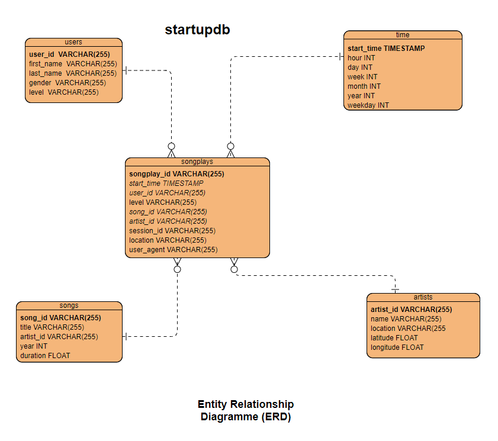

# Data_Modeling_with_Postgres
UNFINISHED YET : _etl.ipynb_ the songplays table is not set up with data yet 
## Introduction
A startup wants to analyze the data they've been collecting on songs and user activity on their new music streaming app. The analytics team is particularly interested in understanding what songs users are listening to. Currently, they don't have an easy way to query their data, which resides in a directory of __JSON logs__ on user activity on the app, as well as a directory with __JSON metadata__ on the songs in their app. 

## Goal
the objectif of this project was to model user activity data to create a database and ETL pipeline in Postgres using __Python__.

## ETL
__ETL__ or extract, transform, load is the general procedure of copying data from one or more sources into a destination system which represents the data differently from the source(s) or in a different context than the source(s). The ETL process became a popular concept in the 1970s and is often used in _Data_Warehousing_.

## Datasets
Data is currently collected for song and user activities, in two directories:
`data/log_data` and `data/song_data`, using JSON files.

### Song dataset 

```json
{
  "num_songs": 1,
  "artist_id": "ARD7TVE1187B99BFB1", 
  "artist_latitude": null, 
  "artist_longitude": null, 
  "artist_location": "California - LA", 
  "artist_name": "Casual", "song_id": 
  "SOMZWCG12A8C13C480", 
  "title": "I Didn't Mean To", 
  "duration": 218.93179, 
  "year": 0
  }
```

### Log dataset 

```json
{
"artist":null, 
 "auth":"Logged In",  
 "firstName":"Walter",  
 "gender":"M",  
 "itemInSession":0, 
 "lastName":"Frye", 
 "length":null, 
 "level":"free",  
 "location":"San Francisco-Oakland-Hayward, CA",  
 "method":"GET",  
 "page":"Home", 
 "registration":1540919166796.0,  
 "sessionId":38,  
 "song":null, 
 "status":200,  
 "ts":1541105830796,  
 "userAgent":"\"Mozilla\/5.0 (Macintosh; Intel Mac OS X 10_9_4) AppleWebKit\/537.36 (KHTML, like Gecko) Chrome\/36.0.1985.143 Safari\/537.36\"",  
 "userId":"39"
 }

```

## Schema Design for the Database
The __Star schema__ design was used to create this database.
The _sql_queries.py_ file contains all of the PostgreSQL queries
The _create_tables.py_ file is used to create the database
### Entity Realtionship Diagram (ERD)


## ETL Pipeline
The _etl.ipynb_ contains the ETL pipeline processe to populate the _songs_ and _artists_ tables from the data within the JSON song files (`data/song_data/`) and to populate the _users_ and _time_ tables from the JSON log files (`data/log_data/`).
